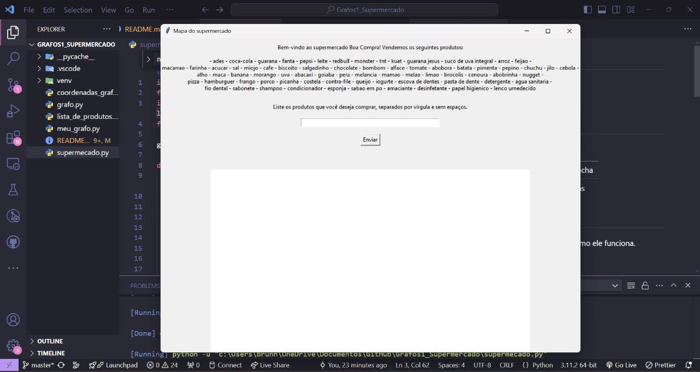
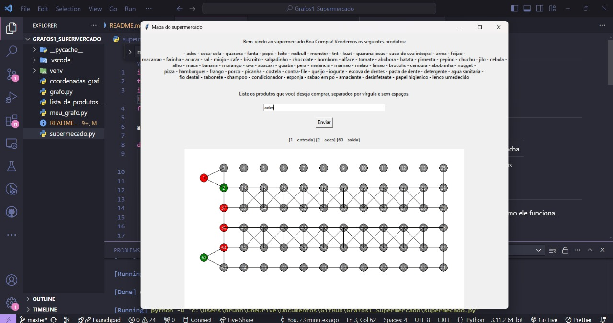
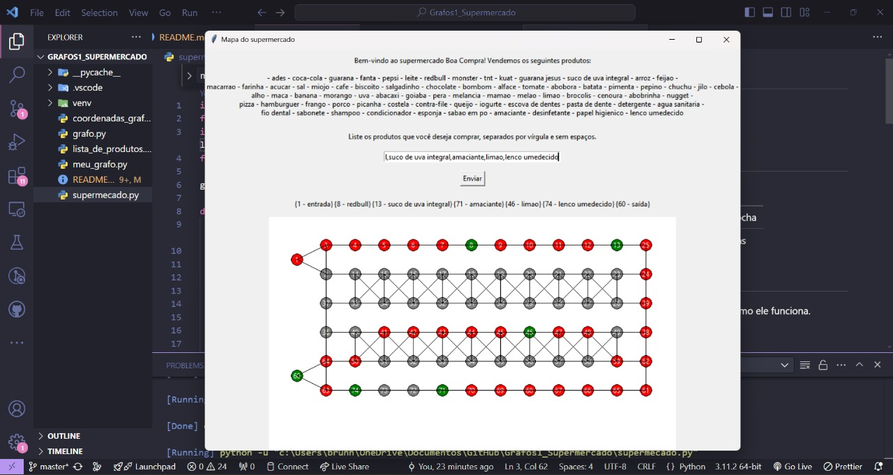

# Supermercado Boa Compra

**Número da Lista**: 1<br>
**Conteúdo da Disciplina**: Grafos 1<br>

## Alunos
|Matrícula | Aluno |
| -- | -- |
| 21/1029156  |  Brunna Louise Martins Rocha |
| 21/1043727  |  Pedro Cabeceira de Freitas |

## Sobre 
Este programa foi desenvolvido como parte de um projeto de Algoritmos e tem como objetivo facilitar a experiência de compra em supermercados. O programa permite que o usuário insira uma lista de compras, exibindo a localização dos produtos no mapa do supermercado. Além disso, ele calcula o caminho mais curto que o usuário deve seguir, partindo da entrada, passando por cada produto da lista, até o caixa. Dessa forma, o programa busca otimizar o trajeto, reduzindo o tempo de compra e melhorando a organização da busca pelos itens.

## Screenshots






## Instalação 
**Linguagem**: Python<br>
**Framework**: n/a<br>

**Ubuntu**:

Para rodar, é preciso ter instalado o Python 3.

```
$ sudo apt-get update
$ sudo apt-get install python3.6
```

Depois, para instalar a biblioteca [tkinter](https://docs.python.org/pt-br/3/library/tkinter.html#module-tkinter):
```
sudo apt-get install python-tk
```


## Uso 
No Visual Code Studio, selecione o arquivo supermercado.py e aperte o botão Run Code. Aparecerá um pop-up na tela com a interface do programa.
Digite sua lista de compras e clique em enviar. O mapa aparecerá na tela e terá três tipos de nós: nós verdes significam produtos que estão na sua lista de compras; nós vermelhos indicam os produtos pelos quais você irá passar, mas que não fazem parte da sua lista de compras; e nós cinzas não fazem parte da sua lista de compras e nem do caminho que deve ser percorrido.
Para sair do programa, basta apertar o x no canto superior direito da interface.


## Restrições do Programa
- O menor caminho calculado pelo programa não é o menor caminho possível: o menor caminho possível entre vários nós é um problema de complexidade n!, o que, com a quantidade de nós contidos no grafo do programa (74), faria com que o programa não rodasse em tempo hábil. Por isso, o menor caminho calculado leva em consideração a ordem dos produtos digitados.
- Caso você digite um produto que não exista no supermercado ou com grafia diferente da listada, o programa ignorará essa entrada. Lembre-se de usar vírgular para separar os produtos e não utilize espaços entre as vírgulas e os produtos.

## Apresentação

[](https://www.youtube.com/watch?v=2V84rKEOg68)

